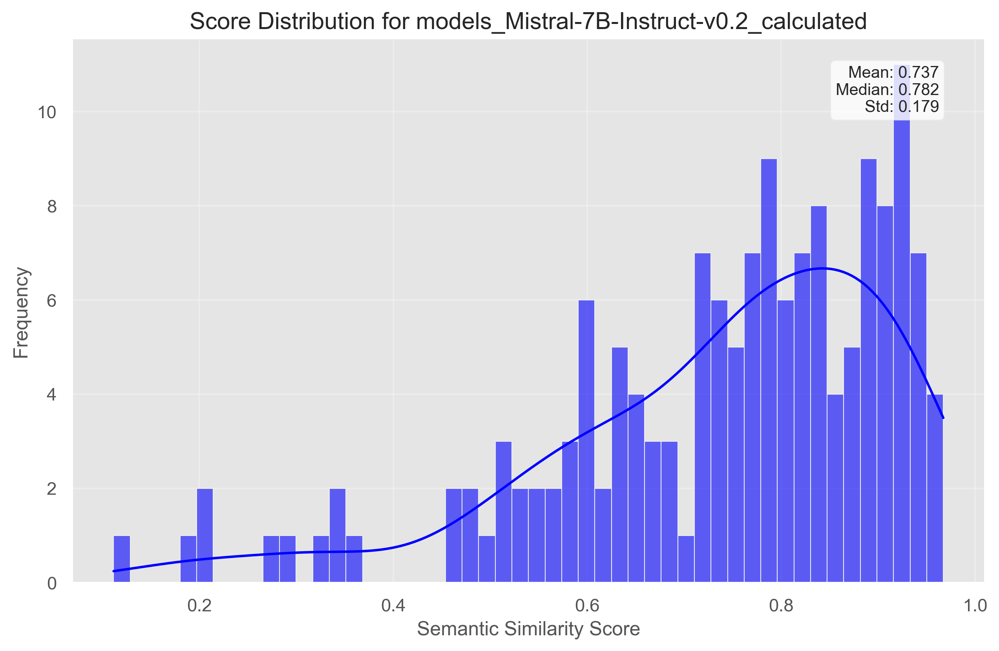
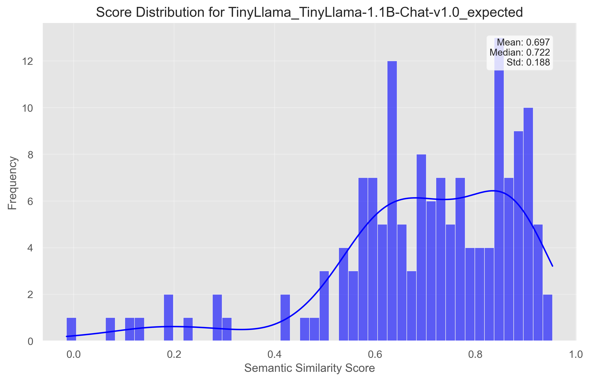

# SemScore-DSPy


## Validation


The `SemScoreValidator` is a utility (in `semscore\utils\validation.py`) for validating the SemScore metric implementation against [reference data](https://github.com/geronimi73/semscore/blob/main/nb_blog_part1_OA-conversations-results/semscores_OA-100.json), ensuring alignment with expected performance. It supports debugging, statistical analysis, and generates brief reports in markdown.


### Default Validation Example
Here’s an example of how to run the validation suite to validate against the SemScore described in [this](https://huggingface.co/blog/g-ronimo/semscore) blog:

```python
from semscore.utils.validation import run_validation
from IPython.display import Markdown, display

# Run validation and generate a report
output_dir = "validation_results"
reference_file = "semscore/data/reference/semscores_OA-100.json"
report = run_validation(output_dir=output_dir, reference_file=reference_file)
print(f"Validation complete. Report saved to: {output_dir}")
display(Markdown(report))
```

We can quickly validate using the figures produced. Here, the following output figures show perfect implementation alignment. These are the reference (👉 right) and calculated (👈 left) SemScore distributions for a TinyLlama-1.1B-Chat-v1.0 (👇 bottom) and a Mistral-7B-Instruct-v0.2 (☝️ top) model. Given the alignment between calculated and reference histograms, it's fair to say that SemScore-DSPy is validated against [Geronimo's](https://github.com/geronimi73) [implementation](https://github.com/geronimi73/semscore).


<div style="display: flex; justify-content: space-around; align-items: center;">
    
    
</div>
<div style="display: flex; justify-content: space-around; align-items: center;">
    
    
</div>


## Characterization

The [SemScore](https://arxiv.org/pdf/2401.17072) paper effectively demonstrated its metric's correlation with human judgment but lacked a thorough characterization of the algorithm, either generally or within specific domains. While it highlights the benefits of cosine similarity, such as its interpretability and directionality: 

> "This value lies within the interval of [-1, 1]. A cosine similarity closer to 1 implies two semantically similar sequences, while negative values suggest semantic opposition."

The paper does not analyze how accurately this directionality captures contradictions, leaving a gap in understanding.

To address this, the SemScore-DSPy tool was developed for applications in RBC-Liposome interaction research. This involved designing a JSON schema and curating a dataset of over 500 text pairs, each assigned one of seven semantic categories: **Identical**, **Paraphrase**, **Similar Content**, **Related Topic**, **Different Domain**, **Unrelated**, and **Contradiction**. The schema includes fields for category, domain, and text pair metadata, ensuring reproducibility and interpretability of the results. Notable highlights are:

- **Category**: Captures semantic relationships, from identical meaning to direct contradiction.
- **Domain** and **Subdomain**: Provide context, e.g., "Technical" or "Academic," with optional specialization like "Blood Research."
- **Expected Range**: Defines similarity thresholds for each category, guiding evaluation consistency.
- **Source and Notes**: Document data origins and explanations for edge cases, such as ambiguous contradictions.


### Key Visualizations


The code produces the following figures:


From **top left to bottom left**, going **clockwise**:  

1. The first figure (**☝️ top 👈 left**) is a violin plot showing the distributions of the SemScores across the seven semantic categories defined in the dataset. Each distribution appears distinct and almost laddered, with the "Contradiction" category being an exception, as it shows more variability and does not conform to the laddered structure.  

2. The second figure (**☝️ top 👉 right**) is a common language effect size (CLES) matrix that compares semantic categories in terms of size superiority. Each cell represents the probability of a randomly drawn score from the row category being greater than a randomly drawn score from the column category. The most notable observation here is that a random score from the "Paraphrase" category has only a slight (56.2%) chance of being greater than a random score from the "Contradiction" category.  

3. The bottom two figures (**👇 bottom 👈 left** and **👇 bottom 👉 right**) show the bootstrap (minimum of 10,000 replicates) of the mean for each semantic category and their 95% confidence intervals. The means appear distinct overall, but there is almost overlap between the confidence intervals for the "Paraphrase" and "Contradiction" categories in the rightmost figure, reflecting the negligible differentiation between them seen in the CLES matrix.  

### Key Insights  

Based on these figures, the distributions and means of the SemScores across semantic categories generally appear distinct. This suggests that these categories could serve as general rules of thumb for SemScore analysis in the domain of RBC-liposome research. However, there are still some issues:  

- The **effect size between "Paraphrase" and "Contradiction"** is negligible. A random "Paraphrase" SemScore has only a slightly better probability of exceeding a "Contradiction" SemScore.  
- **"Contradiction" SemScores outperform most other categories** (≥77.8% probability) in random pairwise comparisons, except for the "Identical" abd "Paraphrase" categories.  


Therefore, a high SemScore could indicate either an accurate paraphrase of the ground truth or its complete opposite, presenting challenges in interpretation.   The overlap between "Paraphrase" and "Contradiction" categories highlights potential ambiguity in SemScore categorization, which may limit its utility as a standalone metric.  

