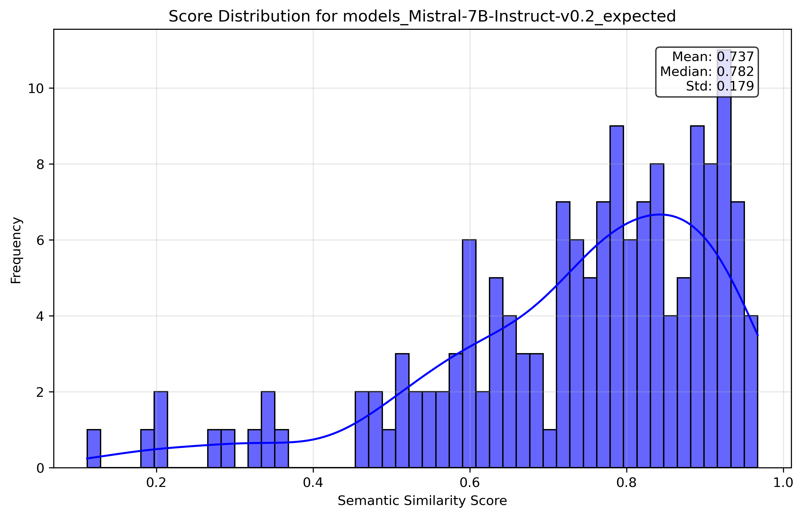
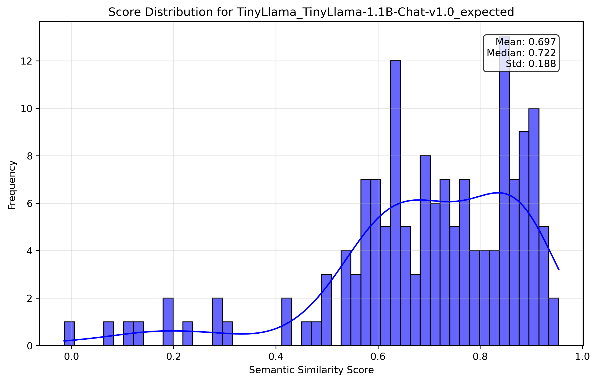

# SEMSCORE-DSPY


## Validation


The `SemScoreValidator` is a utility (in `semscore\utils\validation.py`) for validating the SemScore metric implementation against [reference data](https://github.com/geronimi73/semscore/blob/main/nb_blog_part1_OA-conversations-results/semscores_OA-100.json), ensuring alignment with expected performance. It supports debugging, statistical analysis, and generates brief reports in markdown.


### Example Usage
Here’s an example of how to run the validation suite:

```python
from semscore.utils.validation import run_validation
from IPython.display import Markdown, display

# Run validation and generate a report
output_dir = "validation_results"
reference_file = "semscore/data/reference/semscores_OA-100.json"
report = run_validation(output_dir=output_dir, reference_file=reference_file)
print(f"Validation complete. Report saved to: {output_dir}")
display(Markdown(report))
```

The following output figures are the reference and calculated SemScore distributions of a TinyLlama-1.1B-Chat-v1.0 and a Mistral-7B-Instruct-v0.2 model. Given the perfect alignmentbetween calculated and reference histograms, it's fair to say that SemScore-DSPy is validated against [Geronimo's](https://github.com/geronimi73) [implementation](https://github.com/geronimi73/semscore).


<div style="display: flex; justify-content: space-around; align-items: center;">
    
    
</div>
<div style="display: flex; justify-content: space-around; align-items: center;">
    
    
</div>
